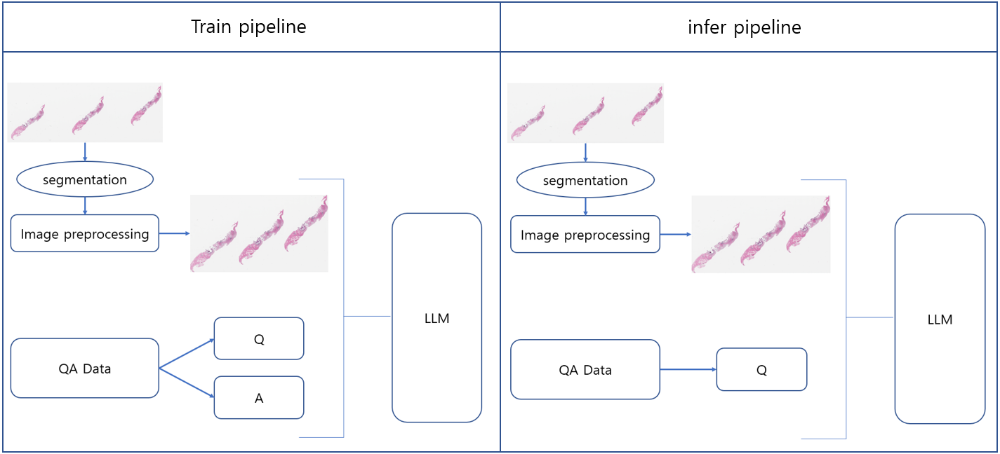

# WQA
I wanted to process the whole slide image by cutting it into patches, but the downloaded data had a lower resolution than typical whole slide images, and when cut into patches, I couldn’t extract sufficient feature information.
I believe that the dataset consists of images converted to PNG format from the lowest resolution level of whole slide images in SVS format (although this may not be the case). Therefore, instead of cutting them into patches, 
we used the low-resolution whole slide images as they are to construct the VQA dataset and train the model.

## Environment
The OS used was Linux.
I did it in cuda 11.8 version.

- segmentation
```
# install mmengine
pip install mmengine==0.10.5

# install mmcv
pip install mmcv==2.2.0 -f https://download.openmmlab.com/mmcv/dist/cu118/torch2.4/index.html

# install mmsegmentation
git clone https://github.com/open-mmlab/mmsegmentation.git # 1.2.2 version
cd ./mmsegmentation
python setup.py develop
```
Change MMCV_MAX = '2.2.0' to MMCV_MAX = '2.2.1' in ./mmsegmentation/mmseg/__init__.py

- requirement
```
pip install -r requirement.txt
```

## Usage data
- I used Dacon data [link](https://dacon.io/competitions/official/236011/overview/description)
- This dataset is used to determine whether breast cancer has metastasized to the lymph nodes.

## Pipe Line


## segmentation train and image preprocessing
### whole slide image mask image Generate
- wsi mask image gen code
```
python ./utils/wsi_core/mask_gen.py
```

### Segmentation model train
```
./tissue_segmentation/train.sh
```
### segmentation train results
| Class      | IoU   | Acc   |
|------------|-------|-------|
| background | 98.0  | 99.02 |
| tissue     | 91.84 | 95.61 |

- model download link : [link]()

### image preprocessing
```
./image_preprocessing.sh
```

## vqa dataset Generate and vqa training
### vqa dataset Generate
```
python ./utils/wsi_core/vqa_data_gen.py
```

### vqa model train
```
./train.sh
```

### eval
```
./eval.sh
```

### eval results
| bleu | rouge1 | rouge2 | rougeL | rougeLsum | meteor | model link |
| 0.6785 | 0.7329 | 0.5847 | 0.7326 | 0.7327 | 0.7878 | [link]() |

## Reference
- [WSI-VQA: Interpreting Whole Slide Images by Generative Visual Question Answering](https://arxiv.org/abs/2407.05603)
  - [github](https://github.com/cpystan/WSI-VQA/tree/master?tab=readme-ov-file)
- [MamMIL: Multiple Instance Learning for Whole Slide Images with State Space Models](https://arxiv.org/pdf/2403.05160)
- [TransMIL: Transformer based Correlated Multiple Instance Learning for Whole Slide Image Classification](https://arxiv.org/abs/2106.00908)
- [Generalizable Whole Slide Image Classification with Fine-Grained Visual-Semantic Interaction](https://openaccess.thecvf.com/content/CVPR2024/papers/Li_Generalizable_Whole_Slide_Image_Classification_with_Fine-Grained_Visual-Semantic_Interaction_CVPR_2024_paper.pdf)
- [ViLa-MIL: Dual-scale Vision-Language Multiple Instance Learning for Whole Slide Image Classification](https://openaccess.thecvf.com/content/CVPR2024/papers/Shi_ViLa-MIL_Dual-scale_Vision-Language_Multiple_Instance_Learning_for_Whole_Slide_Image_CVPR_2024_paper.pdf)
- [Cluster-to-Conquer: A Framework for End-to-End Multi-Instance Learning for Whole Slide Image Classification](https://arxiv.org/pdf/2103.10626)
- [Deep Learning Models for Histopathological Classification of Gastric and colonic epithelial tumours](https://www.nature.com/articles/s41598-020-58467-9)

